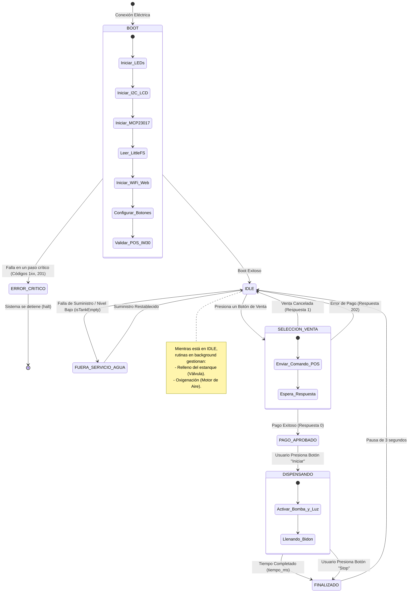

# Diagrama de Flujo - Máquina de Agua V2

El siguiente diagrama ilustra la lógica completa del sistema a través de sus diversos estados, según está programado en `AppLogic.cpp`.

```mermaid
stateDiagram-v2
    [*] --> BOOT : Conexión Eléctrica
    
    state BOOT {
        [*] --> Iniciar_LEDs
        Iniciar_LEDs --> Iniciar_I2C_LCD
        Iniciar_I2C_LCD --> Iniciar_MCP23017
        Iniciar_MCP23017 --> Leer_LittleFS
        Leer_LittleFS --> Iniciar_WiFi_Web
        Iniciar_WiFi_Web --> Configurar_Botones
        Configurar_Botones --> Validar_POS_IM30
    }
    
    BOOT --> ERROR_CRITICO : Falla en un paso crítico (Códigos 1xx, 201)
    ERROR_CRITICO --> [*] : Sistema se detiene (halt)
    
    BOOT --> IDLE : Boot Exitoso
    
    IDLE --> FUERA_SERVICIO_AGUA : Falla de Suministro / Nivel Bajo (isTankEmpty)
    FUERA_SERVICIO_AGUA --> IDLE : Suministro Restablecido
    
    IDLE --> SELECCION_VENTA : Presiona un Botón de Venta
    
    state SELECCION_VENTA {
        [*] --> Enviar_Comando_POS
        Enviar_Comando_POS --> Espera_Respuesta
    }
    
    SELECCION_VENTA --> PAGO_APROBADO : Pago Exitoso (Respuesta 0)
    SELECCION_VENTA --> IDLE : Venta Cancelada (Respuesta 1)
    SELECCION_VENTA --> IDLE : Error de Pago (Respuesta 202)
    
    PAGO_APROBADO --> DISPENSANDO : Usuario Presiona Botón "Iniciar"
    
    state DISPENSANDO {
        [*] --> Activar_Bomba_y_Luz
        Activar_Bomba_y_Luz --> Llenando_Bidon
    }
    
    DISPENSANDO --> FINALIZADO : Tiempo Completado (tiempo_ms)
    DISPENSANDO --> FINALIZADO : Usuario Presiona Botón "Stop"
    
    FINALIZADO --> IDLE : Pausa de 3 segundos
    
    note right of IDLE
      Mientras está en IDLE,
      rutinas en background gestionan:
      - Relleno del estanque (Válvula).
      - Oxigenación (Motor de Aire).
    end note
```
